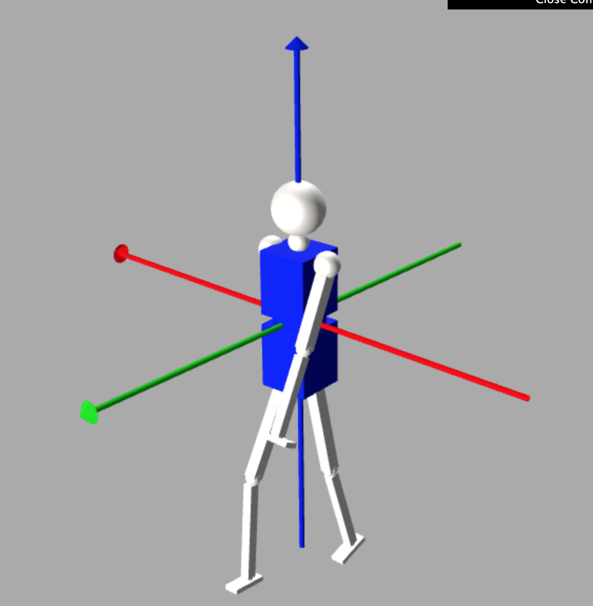

# Human 3d Pose Estimation
Multipose 3d pose estimation using 2d pose estimation deep learning models in OpenVino

For the field of industrial robot interaction, as a research tool or for simple motion applications there’s a need for building fast and accurate human pose estimation, either for limiting speed or acceleration in the robot task execution, or for real time job interaction between humans and robots, this work propose to study a moderately easy to use, and fast commissioning 3d human pose detection system using multiple camera images, multiple deep learning models inference in a state of the art joint estimation system.

## 3d detection
For the system to work accurately, instead of a solution based on depth calculation by a parallel 2 camera system, a multicamera system is proposed, where all the cameras should be pointing at the observation zone, preferably pointing at the center of observation; cameras have to be callibrated (possible calibration scripts are to be made). The minumin quantity of cameras is 2, maximun 4, the more cameras better accuracy, at the price of more computation needs, every camera needs an estimation thread every frame, which consists on a set of OpenVino infererences (one for detecting subjects) plus one more for every subject for 2d pose estimation.

The estimation threads are evalluated by pairs building a 3d point for every human joint detected on the pair of images, then a bayesian estimator is used to determine the most probable location for every joint, in the case of be using the 2 camera mode there's no bayesian processing needed.

## Humanoid description
For rendering proporses, humanoid.urdf contains an URDF model that could rewpresent the captured pose of individuals in a simulation environment, The urdf description is written in humanoid.urdf is based on a robot description format and It has totally 22 degrees of freedom.

The scripts joining the read 3d position and rendering are work in progress...

## Setting Up
Packages needed to run the samples are:
- Python 3.5+
- OpenVino 2020.0 (works on OpenVino 2019)
- OpenCV 4.0+
- Bokeh Server

## Running
To run the examples jypiter notebooks can be used,

for the Bokeh app directly from a Bokeh server, navigate to the parent directory
[`Human 3dPose app`](https://github.com/rwilmar/human3dPose.git),
and execute the command

    bokeh serve --show dashboard

## Licences

This example uses vendored code from the following projects:

* https://fontawesome.com/license
* https://getbootstrap.com/docs/3.3/getting-started/
* https://github.com/puikinsh/gentelella/blob/master/LICENSE.txt

Other packages and licences related are under testing 